<div align="center">

</div>
<br/>
```bash
amine@github:~$ cat about.txt
```
> I am a software engineer passionate about building scalable web applications and
> exploring the frontiers of AI. My current focus is deep-diving into full-stack
> development, with an emphasis on system design and architecting distributed,
> resilient systems. Always building, always learning.
```bash
amine@github:~$ ls -la stack/
```
Category	Icons
Frontend	
Backend	
AI / ML	 `+ LangGraph, OpenCV, Scikit-learn`
Mobile	
Infrastructure	 `+ Hostinger`
Databases	 `+ Qdrant`
```bash
amine@github:~$ ./connect.sh --all
```
<p align="left">
<a href="https://www.linkedin.com/in/anes-bouhaik-1a8956272/" target="blank"></a>
<a href="https://www.instagram.com/s2njuaw" target="blank"></a>
</p>
```bash
amine@github:~$ █
```
